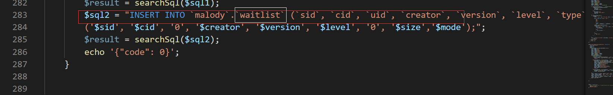

# Malody5.0私服文档

### 版本要求：

php>=7.4

mysql >=5.7

apache2或者nginx均可

### 搭建文档：

需要更改内容：

网站搭建完成后直接访问主域名，进入初次配置页面

username，password改为你的数据库密码，

ip改为服务器的公网ip，本地的话就填写127.0.0.1

MySQL如果是和网站在同一个服务器搭建，也填写127.0.0.1，否则应填写网络地址

### 游戏内使用：

如图，http://ip/index.php，一定要加index.php,否则无用

### 特色功能

访问ip/admin.php

进入后端管理，可以进行对谱面管理，谱面审核等一系列功能，非常好用

### 谱面上传流程：

谱面上传后进入待审核页面，管理员通过后才进入正式谱面中。

如需测试更改，将index.php中的

waitlist改为charts即可

### 已知安全性问题：

1.sql注入漏洞

2.任意文件上传漏洞

3.任意文件读取漏洞

建议：如果需要部署在公网做一个私有服务器，最好上个waf，推荐云盾，宝塔，安全狗都可以

### DoList

- [ ] admin翻页功能
- [ ] 活动页面
- [ ] admin搜索功能
- [ ] 安全性提高